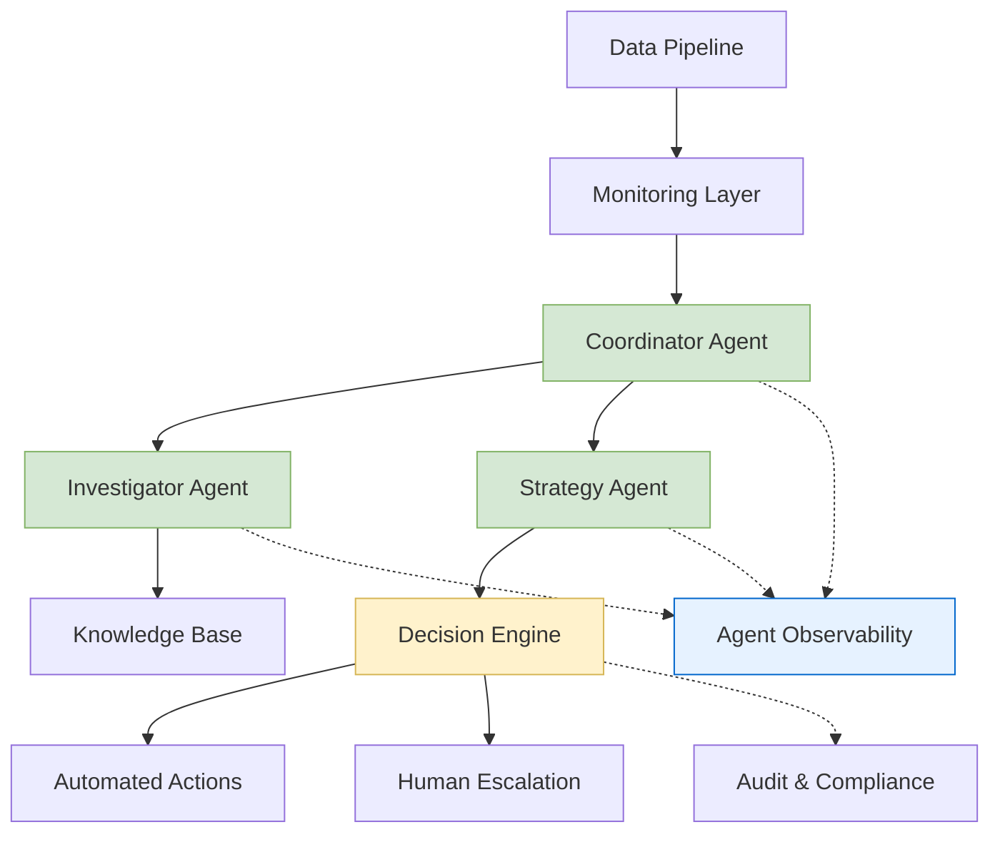

# MLOps Agentic AI System

**Problem Statement:** Built an autonomous MLOps system that detects, investigates, and responds to data drift without human intervention, reducing response time from hours to minutes while maintaining safety and compliance standards.

## High-Level Architecture

## Tech Stack

**AI & ML Framework:**
- Google Agent Development Kit (ADK) for multi-agent orchestration
- Ollama/Gemini for large language models
- ChromaDB for RAG-based knowledge retrieval

**Data Pipeline & Orchestration:**
- Kedro for ML pipeline management
- Redis Streams for event-driven architecture
- MLflow for model registry and versioning

**Backend & Infrastructure:**
- Python with Pydantic for type safety
- YAML configuration management
- JSON Lines for audit logging

**Observability & Monitoring:**
- Langfuse for LLM tracing and debugging
- Structured logging with correlation ID tracking
- End-to-end workflow monitoring

### 🚫 Why No/Partial Code?

To protect intellectual property and maintain project integrity, the full source code is not publicly available. However, the documentation provides deep insight into the system’s design, philosophy, and capabilities.

## Key Features

### Intelligent Drift Response
- **Automated Investigation:** AI agents analyze drift patterns using historical knowledge base
- **Strategic Planning:** Context-aware remediation strategies with confidence scoring
- **Autonomous Execution:** High-confidence actions executed automatically within safety constraints

### Multi-Agent Architecture
- **Coordinator Agent:** Orchestrates the entire response workflow
- **Investigator Agent:** Performs root cause analysis of drift events
- **Strategy Agent:** Formulates actionable remediation plans with cost-benefit analysis

### Safety & Compliance Framework
- **Confidence-Based Autonomy:** Actions only executed when confidence exceeds 80% threshold
- **Risk Validation:** Pre-flight checks for cost limits, blackout periods, and business rules
- **Smart Escalation:** Uncertain scenarios automatically escalated to human operators
- **Comprehensive Audit Trail:** Every decision tracked with full context and reasoning

### End-to-End Observability
- **Correlation ID Tracing:** Track individual events through the entire distributed system
- **LLM Interaction Monitoring:** Deep visibility into agent reasoning and tool usage
- **Performance Analytics:** Monitor response times and success rates across workflows

## Design Highlights

### Event-Driven Architecture
Implemented Redis Streams as the communication backbone, enabling loose coupling between drift detection, agent processing, and action execution. This design ensures system resilience and allows for independent scaling of components.

### Deterministic Safety Layer
Created a hybrid approach where LLM agents handle complex reasoning and strategy formulation, while a deterministic Python function enforces business rules and safety constraints. This prevents non-deterministic AI from making critical safety decisions.

### RAG-Enhanced Decision Making
Integrated retrieval-augmented generation with specialized knowledge bases:Historical patterns, troubleshooting guidance etc

### Autonomous Action Framework
Implemented three-tier decision making:
1. **Execute** 
2. **Escalate** Human in the loop
3. **Monitor:** Low-impact issues logged for pattern analysis

## System Capabilities

- **Response Time:** Reduced drift response from hours to 3-5 minutes
- **Autonomy Rate:** 70%+ of drift events handled without human intervention
- **Safety Record:** Zero unauthorized actions through multi-layer validation
- **Observability:** Complete audit trail with LLM reasoning transparency
- **Scalability:** Event-driven architecture supports concurrent drift handling

## Architecture Benefits

This design demonstrates several key architectural patterns:
- **Microservices:** Decoupled components communicating via events
- **AI/ML Integration:** Practical application of LLMs in production systems  
- **Observability:** Production-ready monitoring and debugging capabilities
- **Safety Engineering:** Multi-layer validation for autonomous systems
- **Event Sourcing:** Immutable audit trail for compliance and debugging

The system showcases how modern AI agents can be integrated into production MLOps workflows while maintaining the safety, reliability, and observability standards required for business-critical applications.
