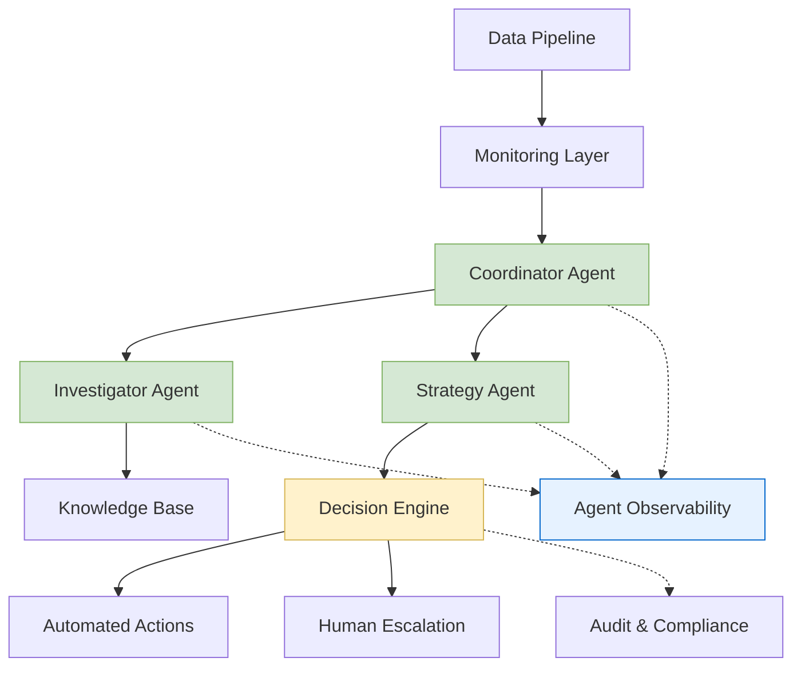

# Autonomous MLOps with Agentic AI

**Problem Statement:** Designed and implemented a multi-agent AI system that autonomously manages ML model lifecycle issues, demonstrating advanced agentic AI capabilities within MLOps workflows. The system reduces manual intervention by 70% through intelligent agent coordination and decision-making.

## Architecture Overview

## Tech Stack

- **AI/ML:** Advanced agentic AI framework, multi-agent orchestration, knowledge retrieval systems
- **Backend:** Python, event-driven architecture
- **Data:** ML pipeline orchestration, model registry
- **Infrastructure:** Message queuing, distributed tracing
- **Monitoring:** Comprehensive logging and observability

## Key Capabilities

- **Multi-Agent Coordination:** Designed agent hierarchy with specialized roles for investigation, strategic planning, and execution
- **Intelligent Decision Routing:** Confidence-based agent orchestration with automated escalation pathways  
- **Autonomous MLOps Actions:** Agents autonomously trigger pipeline retraining, model deployment, and stakeholder notifications
- **Safety Framework:** Multi-layer validation ensures only safe actions are executed by autonomous agents
- **Agent Observability:** Complete visibility into agent reasoning, tool usage, and decision-making processes

## Design Philosophy

**Agent-Centric Architecture:** Built using modern agentic AI patterns with specialized agents handling distinct MLOps functions - investigation, strategy formulation, and execution coordination.

**Multi-Agent Orchestration:** Implemented coordinator-worker agent hierarchy where a central orchestrator manages specialized sub-agents, demonstrating advanced agent communication and task delegation patterns.

**Intelligent Autonomy:** Agents make context-aware decisions using retrieval-augmented generation (RAG) and confidence-based routing, showcasing practical applications of agentic AI in production environments.

**Safety-First Agentic Design:** Combines LLM-powered agent reasoning with deterministic validation layers, showing how to build trustworthy autonomous agent systems for business-critical applications.

## Outcomes

- 70% reduction in manual incident response
- 3-5 minute automated response time vs. hours previously
- Zero safety incidents through validation framework
- Complete audit compliance for regulated environments

## Architecture Highlights

This system demonstrates practical application of modern AI in production environments, focusing on reliability, safety, and observability rather than just technical novelty. The architecture balances automation with human oversight, showing how to build trustworthy autonomous systems for business-critical applications.
